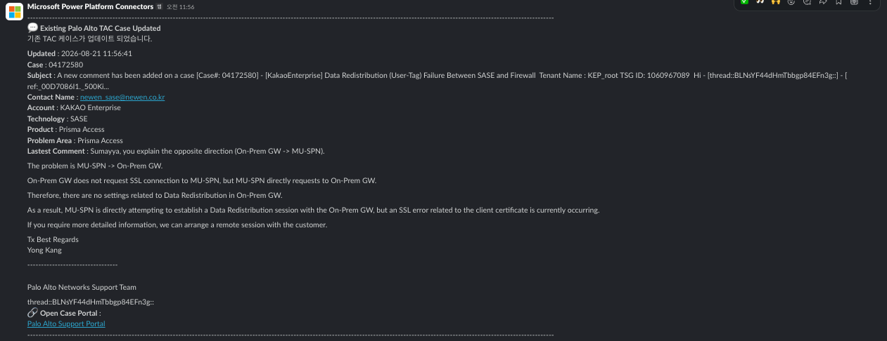
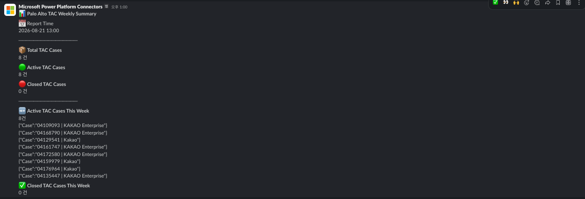

# Palo Alto TAC Automation

Power Automate 기반 Palo Alto TAC 운영 자동화 프로젝트

## Components

### Palo Alto TAC Thread LAB

실시간 TAC Case 메일 처리

기능

- 신규 TAC 감지
- 기존 TAC 업데이트 감지
- TAC 종료 감지
- Slack Thread 자동 관리
- SharePoint TAC DB 업데이트

---

### Palo Alto TAC Weekly Summary

매주 금요일 13:00 KST

Slack 주간 리포트

포함 내용

- Total TAC Cases
- Open TAC Cases
- Closed TAC Cases
- Active TAC Cases
- Closed TAC Cases This Week

---

### Palo Alto TAC Weekly Cleanup

매주 금요일 18:00 KST

Slack 주간 리포트

기능

- Closed 상태 TAC 조회
- 7일 이상 지난 TAC 삭제
- Slack Cleanup 로그 전송

---

## SharePoint Schema

- CaseNumber
- Account
- Technology
- Product
- ProblemArea
- Status
- LastUpdated
- ClosedDate

---

## Integrations

- Microsoft Power Automate
- SharePoint Online
- Slack
- Office 365 Outlook

---

## Future Enhancement

- TAC Aging Report
- Product Statistics
- Customer Statistics
- Security Advisory Alert
- SSL Certificate Expiration Monitoring
